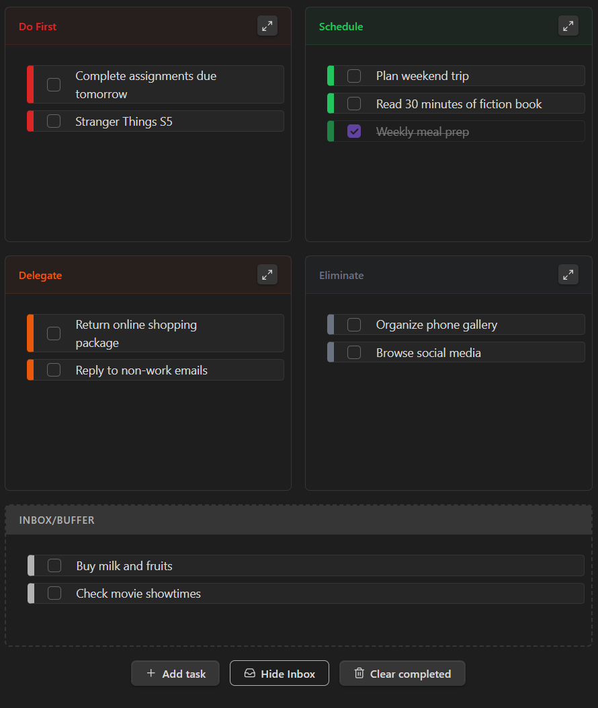

# QuadTasks



**A visual task management plugin for Obsidian based on the Eisenhower Matrix.**

QuadTasks helps you prioritize your workload by categorizing tasks into four distinct quadrants based on urgency and importance. Unlike standard to-do lists, QuadTasks forces you to make decisions about what truly matters, helping you focus on execution rather than just collection.

 

## Key Features

  * **Interactive Matrix:** A fully interactive 2x2 grid representing the Eisenhower Matrix (Do First, Schedule, Delegate, Eliminate).
  * **Drag & Drop:** Seamlessly move tasks between quadrants or reorder them within lists using native drag-and-drop.
  * **Integrated Inbox:** A toggleable "Inbox" buffer to capture tasks quickly ("Decide later") without breaking your flow.
  * **Focus Mode:** Zoom into a single quadrant to eliminate distractions and focus on specific priority groups.
  * **Markdown Native:** Tasks are stored as plain text within your notes. Supports standard Obsidian syntax including `[[wikilinks]]`, `#tags`, and formatting.
  * **Smart State:** Remembers your view preferences (Inbox visibility, Focus mode) per file.

## Usage

### 1\. Creating a Matrix

To add a matrix to any note, insert a code block using the `eisenhower`, `eisen`, or `todoeh` alias:

````markdown
```eisenhower
```
````

### 2\. Adding Tasks

You can add tasks using the **"Add task"** button in the UI, or by manually typing them inside the code block.

**Manual Syntax:**
The plugin uses a specific format to track quadrants. You generally don't need to type this manually, but it is useful for bulk editing:

```markdown
- [ ] (urgent-important) Finish Report
- [ ] (not-urgent-important) Schedule dentist appointment
- [ ] (urgent-not-important) Reply to incidental emails
- [ ] (not-urgent-not-important) Scroll social media
- [ ] (buffer) Buy groceries
```

### 3\. The Quadrants

  * **Do First (Urgent & Important):** Crises, deadlines, and immediate problems.
  * **Schedule (Not Urgent & Important):** Strategic planning, and long-term goals.
  * **Delegate (Urgent & Not Important):** Interruptions, some meetings, and proximate pressing matters.
  * **Eliminate (Not Urgent & Not Important):** Time wasters and trivial activities.

## Installation

> **Note:** QuadTasks is not yet listed in the Obsidian Community Plugins directory.  
> You will need to install it manually until it becomes available there.


### Manual Installation

1.  Download the latest release from the GitHub Releases page.
2.  Extract the files (`main.js`, `manifest.json`, `styles.css`) into your vault folder: `.obsidian/plugins/quadtasks/`.
3.  Reload Obsidian.

## Development

If you want to customize or contribute to QuadTasks:

1.  Clone the repository.
2.  Run `npm install`.
3.  Run `npm run dev` to start the compiler in watch mode.

## About Siran

**QuadTasks** is built by **Siran**.

We create tools that support organization and focus, helping you manage your digital workflow more effectively.

Siran includes a growing set of open-source and premium tools designed to improve everyday productivity.

Learn more at [siran.app](https://siran.app/).

-----

**License:** MIT

